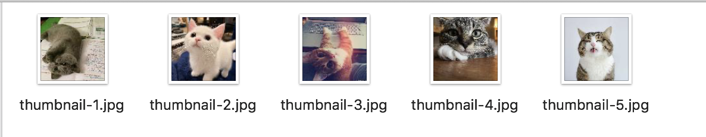

= Thumbnail Demo



This project includes the following modules:

* link:image-thumbnail-processor/[image-thumbnail-processor] - A simple function to create thumbnails from JPEG files.
* link:image-thumbnail-standalone/[image-thumbnail-standalone] - A standalone Spring Boot Demo
* link:image-thumbnail-sink/[image-thumbnail-sink] - A Spring Cloud Stream Sink Application for Kafka

== Build

```bash
./mvnw clean install
```