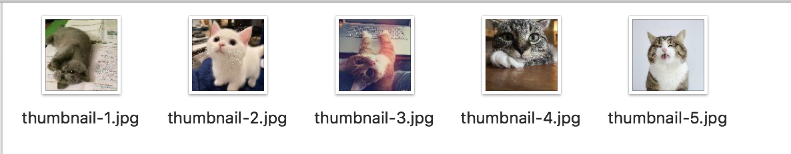

= Thumbnail Sink

A Spring Cloud Stream Sink which composes thumbnailProcessor|filenameEnricher|fileConsumer to create thumbnails and write to a file.

This app registers the link:../image-thumbnail-processor/src/main/java/io/spring/example/image/thumbnail/processor/ThumbnailProcessor.java[ThumbnailProcessor] as a Spring bean and uses the standard https://github.com/spring-cloud/stream-applications/tree/master/functions/consumer/file-consumer[fileConsumer] to write files.
It implements a link:src/main/java/io/spring/example/image/thumbnail/sink/ThumbnailSinkApplication.java[filenameEnricher] function, which generates filenames as
`thumbnail-%d.jpg`, incrementing the index on each execution, supplied to the fileConsumer in the `filename` message header.
See Also link:src/main/resources/application.properties[application.properties].

== Build

```
./mvnw clean install
```

== A Demonstration


We will use this sink in a streaming application that reads a text file containing image URLs and create a thumbnail file for each image: `file-source | http-request-processor | image-thumbnail-sink`

=== Download the pre-packaged Source and Processor applications:

```
wget https://repo.spring.io/snapshot/org/springframework/cloud/stream/app/file-source-kafka/3.0.0-SNAPSHOT/file-source-kafka-3.0.0-SNAPSHOT.jar
wget https://repo.spring.io/snapshot/org/springframework/cloud/stream/app/http-request-processor-kafka/3.0.0-SNAPSHOT/http-request-processor-kafka-3.0.0-SNAPSHOT.jar
```

=== Start a Kafka message broker

With the following `docker-compose.yml`:

```yaml
version: '2'
services:
  zookeeper:
    image: wurstmeister/zookeeper
    ports:
      - "2181:2181"
  kafka:
    image: wurstmeister/kafka
    ports:
      - "9092:9092"
    environment:
      KAFKA_ZOOKEEPER_CONNECT: zookeeper:2181
    volumes:
      - /var/run/docker.sock:/var/run/docker.sock
```

Start Kafka with
```
docker-compose up
```

== Start the sink
Build this sink, if you haven't already done it.
Create a directory `thumbnails`.
Then open a terminal window and run:

```
java -jar target/image-thumbnail-sink-0.0.1-SNAPSHOT.jar --file.consumer.directory=$(PWD)/thumbnails --spring.cloud.stream.bindings.input.destination=thumbnail --server.port=0
```


== Start the source and processor

Create the source directory `images`.

In separate terminal sessions run the processor and the source:

```
java -jar http-request-processor-kafka-3.0.0-SNAPSHOT.jar --http.request.url-expression=payload --http.request.expected-response-type=byte[] --http.request.maximum-buffer-size=2097152 --spring.cloud.stream.bindings.input.destination=image --spring.cloud.stream.bindings.output.destination=thumbnail --server.port=0
```

```
java -jar file-source-kafka-3.0.0-SNAPSHOT.jar --file.consumer.mode=lines --file.supplier.directory=$(PWD)/images --spring.cloud.stream.bindings.output.destination=image --server.port=0
```

=== Create some data

Using your favorite text editor, create a file in the `images` directory containing some URLs:

```
https://i.imgur.com/FQtKSuv.jpeg
https://i.imgur.com/4Cndaul.jpeg
https://i.imgur.com/FCPLS42.jpeg
https://i.imgur.com/DhzHsz8.jpg
https://i.imgur.com/G7t1ZZl.jpg
https://cdn.freeyork.org/wp-content/uploads/2017/11/handicapped-cat-rexie-fy-4-1152x1152.jpg
```

You should see the thumbnail files in the `thumbnails` directory.



===


